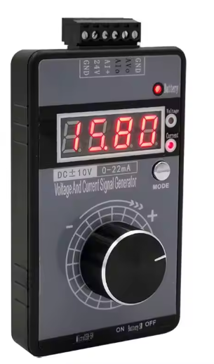
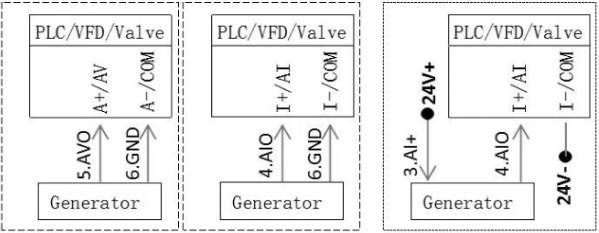

# Signal Generator QH-VSIG2 Voltage Signal Generator 4-20maA

## QH-VISG2-ED DC±10V 0-22mA Signal Generator

**Generator Sinyal Presisi Tinggi (Baterai Terintegrasi)**

### Fitur Utama:

- **Rentang Output Fleksibel:** Rentang tegangan dan arus dapat diatur (default 0-10V/0-20mA).
  - **Tegangan:** 0-10V, 2-10V, 0-5V, 1-5V, 0-3.3V, 0-2.5V, 0-1V, ±10V, ±5V, dan -10V hingga 0V.
  - **Arus:** 0-20mA, 4-20mA, dan 0-22mA.
- **Mode Tampilan Beragam:** Dapat menampilkan nilai tegangan/arus aktual, persentase (100.0%), frekuensi (50.0 Hz), dan metode kustom lainnya.
- **Tegangan Positif & Negatif:** Sangat berguna untuk mengatur motor servo (maju-mundur), mengatasi lampu dimmer yang tidak bisa mati total, atau motor yang bergetar/berputar tipis saat posisi diam.
- **Kompatibilitas Arus:** Mendukung sistem 2-kabel, 3-kabel, dan 4-kabel. Mendukung mode aktif dan pasif. Bisa dihubungkan ke sensor tekanan/suhu analog pasif, maupun ke PLC, inverter, servo driver, dan flow valve.
- **Keamanan Terjamin:** Dilengkapi proteksi arus pendek (short circuit) pada output dan proteksi anti-terbalik (anti-reverse) pada catu daya.
- **Output Linear & Akurat:** Akurasi dapat dikalibrasi agar nilai pada layar sama persis dengan nilai aktual.
- **3 Mode Daya:** DC 15-30V eksternal, USB 5V, atau baterai lithium internal (opsional).
- **Operasi Mudah:** Pindah setelan tegangan/arus cukup dengan satu tombol. Wiring independen dan bisa output simultan.
- **Penyetelan Kasar & Halus:** Jumlah putaran knob (sensitivitas) bisa diatur sesuai kebutuhan.
- **Mode Quick Adjustment:** Mendukung hingga 9 titik poin output yang bisa diatur manual untuk mempercepat proses testing saat produksi.
- **Layar High-Brightness:** Menggunakan tabung digital 0.4" yang terang dengan presisi 0.01. Knob potensiometer *stepless* yang jauh lebih awet dibanding potensiometer biasa.
- **Komponen Industrial:** Menggunakan MOSFET, chip power brand ternama, dan CPU kelas industri untuk stabilitas tinggi di lingkungan kerja yang keras.
- **Memori Output:** Tekan knob untuk menyimpan nilai output. Saat dinyalakan kembali, alat akan menampilkan nilai terakhir yang disimpan.
- **Desain Premium:** Casing matte anti-slip yang tipis, knob aluminium alloy, dan tombol berlapis elektroplating. Nyaman digenggam dan elegan.

------

### Fungsi Baru (Dibandingkan Generasi Pertama):

1. Rentang tegangan kini mendukung hingga **±10V** (memudahkan debugging putaran arah motor).
2. **Output 0V murni:** Benar-benar mencapai 0V (mengungguli produk *single power supply*). Membuat dimmer mati total dan motor benar-benar berhenti.
3. Casing ABS matte ultra-tipis dengan desain tanpa celah (*gapless*).
4. Fitur software baru untuk **Custom Quick Adjustment** (penyetelan cepat nilai tertentu).

------

### Penyetelan Kasar (Coarse) & Halus (Fine):

- **Fine-tuning:** Tambah/kurang 1 angka terakhir dikali koefisien (1-50). Minimal **0.01mA/pulsa**.
- **Coarse-tuning:** Tambah/kurang 1 angka terakhir dikali koefisien (1-50). Maksimal **5.00mA/pulsa**.
- **Catatan:** Satu putaran penuh knob adalah 20 pulsa. (Contoh: Mode halus butuh 100 putaran untuk 0-20mA, mode kasar hanya butuh 1/4 putaran).

------

### Sistem Daya & Baterai:

1. **DC 15V-30V:** Bisa memakai power supply 24V dari PLC.
2. **microUSB:** Bisa pakai powerbank, charger HP, atau port USB komputer.
3. **Baterai Lithium (Opsional):** 1000mAh/3.7V. Mengisi daya otomatis saat terhubung kabel power.
   - **Cek Baterai:** Tahan tombol "MODE" selama 1 detik.
   - **Indikator:** Hijau (>90%), Kuning (>40%), Merah (<40%).

------

### Parameter Teknis Utama:

- **Konsumsi Daya:** 1W (tanpa charge) / 4W (saat charge).

- **Output Tegangan:** ±10V (Akurasi 0.01V, Error 0.5% bisa dikalibrasi).

- **Output Arus:** 0-22mA (Akurasi 0.01mA, Error 0.5% bisa dikalibrasi).

- **Resistor Sampling Arus:** 10-500 ohm.

- **Tampilan:** 4 digit (dua angka di belakang koma).

- **Suhu Kerja:** 0-40°C, kelembapan < 80%.

**1.Voltage Setting** 

| Number    | Description                             | Note                                                         | Default |
| --------- | --------------------------------------- | ------------------------------------------------------------ | ------- |
| F001      | Adjust Mode                             | 0:Coarse 1:Fine 2: Point Mode (Need to set F100 > 0)         | 0       |
| F002      | Output Mode                             | 0:±10V 1:±5V 2:0-10V 3:2-10V 4:0-5V 5:1-5V 6:0-3.3V 7:0-2.5V 8:0-1V 9:-10V-0V | 2       |
| F003      | Display Mode                            | 0:Real Voltage  1:Percentage 0-100.0%  2:50Hz 3:1500         | 0       |
| F004      | Add Or Sub Num For Knob’s Pulse(Coarse) | 1-50 No Decimal Point Concept (1-50)×10                      | 1       |
| F005      | Add Or Sub Num For Knob’s Pulse ( Fine) | 1-50 No Decimal Point Concept (1-50)×1                       |         |
| F006      | -10V Calibration Value                  | -199 — +199 Internal Reference,Please Be Careful             |         |
| F007      | 0V Calibration Value                    | -199 — +199 Internal Reference,Please Be Careful             |         |
| F008      | +10V Calibration Value                  | -199 — +199 Internal Reference,Please Be Careful             |         |
| F009      | Point Mode Num                          | 0: Point Mode Not Use  2-9: Point Num                        | 0       |
| F101…F109 | Point Output Value                      | range : -10V to 10V You can set as many values as there are points |         |

**2.Current Setting**

| Number    | Description                             | Note                                                         | Default |
| --------- | --------------------------------------- | ------------------------------------------------------------ | ------- |
| F001      | Adjust Mode                             | 0:Coarse 1:Fine 2: Point Mode(Need to set F100 > 0)          | 0       |
| F002      | Output Mode                             | 0:0-20mA 1:4-20mA 2:0-22mA                                   | 0       |
| F003      | Display Mode                            | 0:Real Voltage 1:Percentage 0-100.0% 2:50HZ                  | 0       |
| F004      | Add Or Sub Num For Knob’s Pulse(Coarse) | 1-50 No Decimal Point Concept (1-50)×10                      | 1       |
| F005      | Add Or Sub Num For Knob’s Pulse ( Fine) | 1-50 No Decimal Point Concept (1-50)×1                       | 1       |
| F008      | +10V Calibration Value                  | -999 — +999 Internal Reference,Please Be Careful             |         |
| F009      | Point Mode Num                          | 0: Point Mode Not Use 2-9: Point Num                         | 0       |
| F101…F109 | Point Output Value                      | range : 0-22mA You can set as many values as there are points |         |

**Dimension** 

### Manual

- [Manual-datasheet](https://github.com/hwthinker/QH-VISG2-Voltage-Signal-Generator-4-20ma/blob/master/FIT0778manual-EN.pdf) 

- https://youtu.be/YmO9n83lYsA?si=YuJqHsurV0KSmtP5&t=314

  